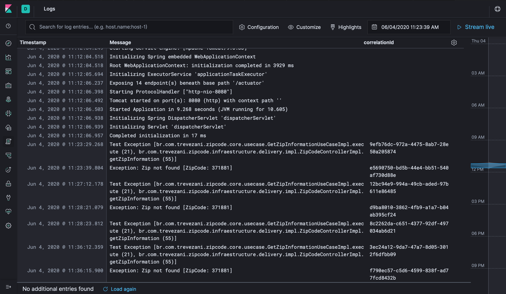
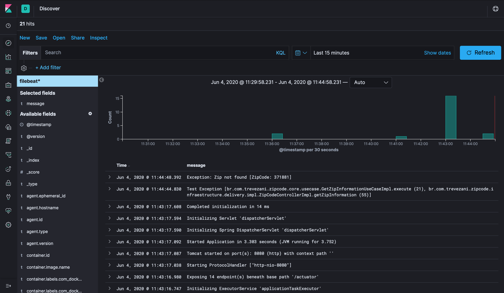
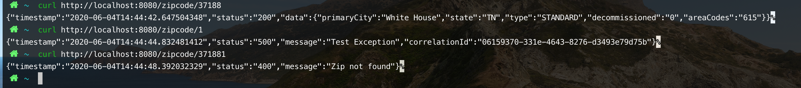

# springboot-fluentd

The full example is present in [microservices-tutorial](https://github.com/trevezani/microservices-tutorial)

***

## Building and Running

* building:
```
mvn clean package -f api-zipcode
mvn docker:build -f api-zipcode/api-zipcode-infraestructure
```
* running:
```
docker-compose -f compose/docker-compose.yml up
```

Links: [[Elastick Search]](http://localhost:9200) [[Kibana]](http://localhost:5601)

Once running, you can call:
```
curl http://localhost:1401/zipcode/37188
```
* checking the memory
```
docker stats $(docker ps --format={{.Names}})
```

***

## Results





